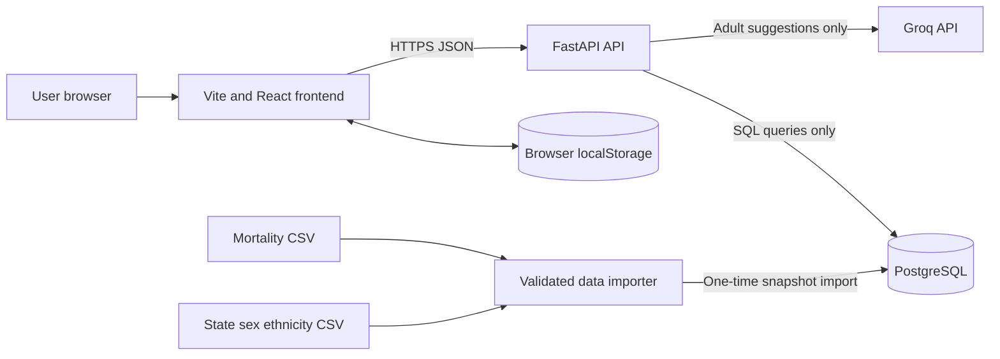
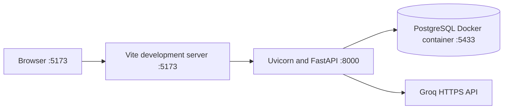
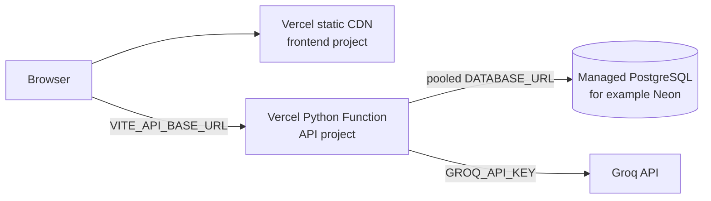
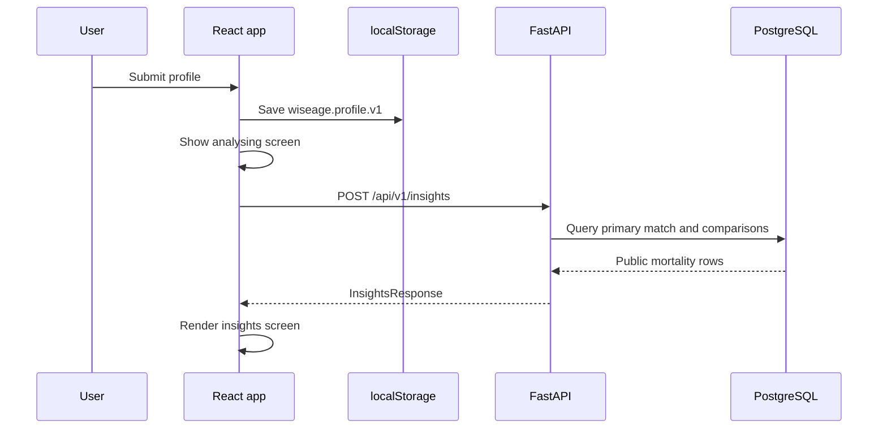
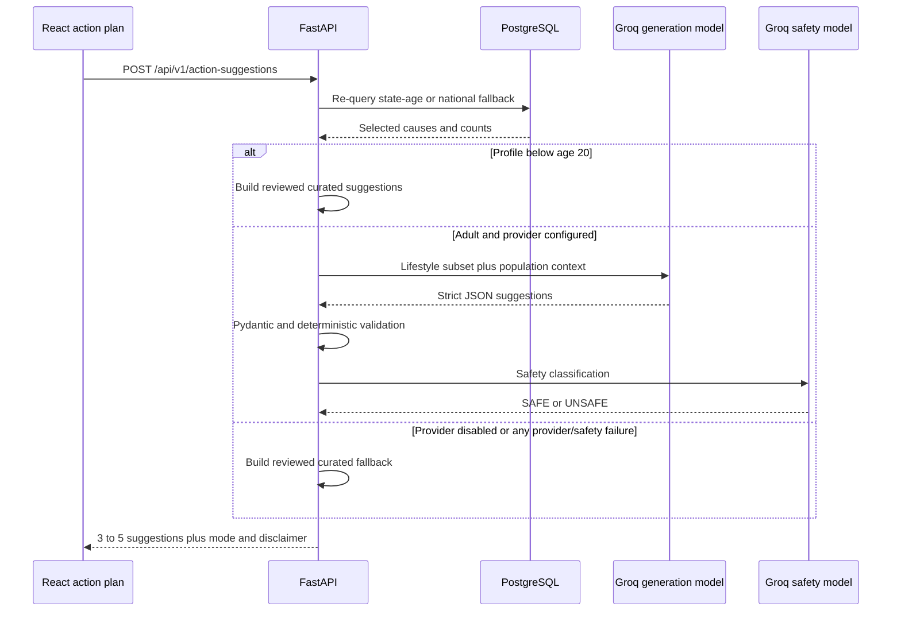
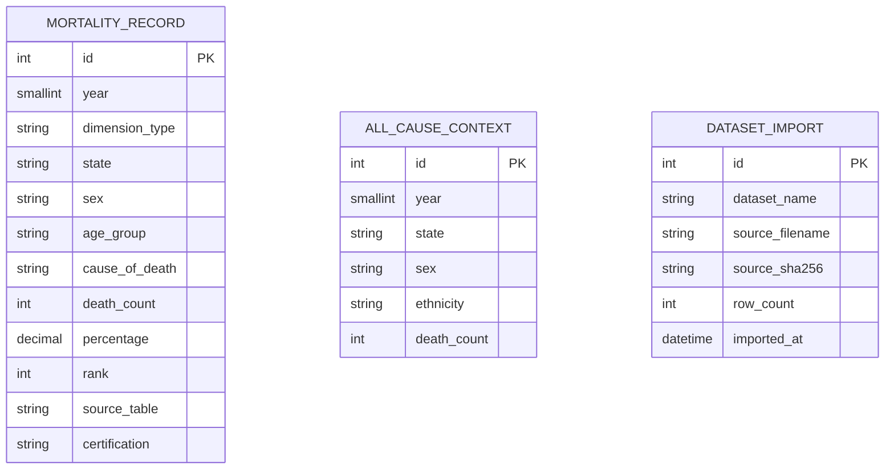

# WiseAge Health system architecture

## 1. Purpose and scope

WiseAge Health is an informational web application that matches a user-selected demographic profile to Malaysian mortality datasets and presents population-level context. It also offers optional wellness action suggestions and a device-local action plan.

The application does **not** calculate personal disease probability, diagnose conditions, or act as a clinical decision-support system. Mortality counts are used as population context only.

This document describes the current implementation, including:

- the Vite/React frontend;
- browser persistence;
- the FastAPI backend and its API contracts;
- PostgreSQL models, migrations, and data import;
- demographic matching and comparison logic;
- Groq-assisted action suggestions and safety controls;
- local and Vercel runtime topology;
- tests, operational behavior, and known limitations.

## 2. System context



The main architectural boundary is between device-local user state and public backend data:

| Data                                | Storage owner             | Persistence                                 |
| ----------------------------------- | ------------------------- | ------------------------------------------- |
| Demographic and lifestyle profile   | Browser                   | `localStorage`, current device and origin |
| Accepted and manual goals           | Browser                   | `localStorage`, current device and origin |
| Cached suggestions and consent      | Browser                   | `localStorage`, current device and origin |
| Current screen and insight response | React memory              | Lost on refresh                             |
| Mortality and all-cause datasets    | PostgreSQL                | Durable public dataset storage              |
| Submitted request profiles          | FastAPI process memory    | Request lifetime only                       |
| Groq prompts and generated text     | External provider request | Not persisted by this application           |

There is no user account, authentication layer, profile table, goal table, or cross-device synchronization.

## 3. Runtime and deployment topology

### 3.1 Local development



Only PostgreSQL runs in Docker. [`compose.yaml`](../compose.yaml) does not define a frontend or API container.

Local configuration is split deliberately:

- root `.env`: Docker port and `VITE_API_BASE_URL`;
- `backend/.env`: database, CORS, application, and Groq settings.

[`backend/sihatq/config.py`](../backend/sihatq/config.py) loads `backend/.env` automatically. Existing process environment variables take priority, which allows Vercel settings to override local files.

### 3.2 Vercel production

The same Git repository is deployed as two Vercel projects:



Frontend project:

- root directory: repository root;
- framework: Vite;
- build: `npm run build`;
- output: `dist`;
- [`vercel.json`](../vercel.json) rewrites requests to `index.html`.

API project:

- root directory: `backend`;
- runtime: Vercel Python/FastAPI;
- entry point: [`backend/index.py`](../backend/index.py), which exports `sihatq.main.app`;
- dependencies and Python version: [`backend/pyproject.toml`](../backend/pyproject.toml);
- [`backend/vercel.json`](../backend/vercel.json) excludes tests, Alembic sources, caches, and bytecode from the deployed function.

Migrations and data imports do not run on application startup or during every Vercel build. They are controlled one-time administrative operations.

## 4. Repository layout

```text
app/
|-- src/
|   |-- main.tsx                    React entry point
|   `-- app/
|       |-- App.tsx                 Navigation, profile, insights, app state
|       `-- ActionPlanPage.tsx      Suggestions and device-local goals
|-- backend/
|   |-- index.py                    Vercel ASGI export
|   |-- pyproject.toml              Python package and dependencies
|   |-- alembic/                    Database migrations
|   |-- sihatq/
|   |   |-- main.py                 FastAPI application and routes
|   |   |-- config.py               Environment configuration
|   |   |-- database.py             SQLAlchemy engine and sessions
|   |   |-- constants.py            Supported dimensions and mappings
|   |   |-- models.py               SQLAlchemy models
|   |   |-- schemas.py              Pydantic API contracts
|   |   |-- service.py              Mortality matching and comparisons
|   |   |-- action_plan.py          Groq, curated actions, safety and fallback
|   |   `-- importer.py             CSV validation and idempotent import
|   `-- tests/                       Importer, API, and action-plan tests
|-- compose.yaml                    Local PostgreSQL only
|-- vercel.json                     Frontend SPA rewrite
`-- .env.example                    Frontend and Docker example settings
```

## 5. Frontend architecture

### 5.1 Entry point and navigation

[`src/main.tsx`](../src/main.tsx) mounts the application. [`src/app/App.tsx`](../src/app/App.tsx) is the primary frontend composition root.

Navigation is implemented as a React state machine, not URL routing:

```ts
type Screen =
  | "landing"
  | "profile"
  | "analysing"
  | "insights"
  | "action-plan";
```

`App` conditionally renders one screen according to the `screen` state. Because the selected screen is not encoded in the URL, a full refresh starts at the landing screen. Saved profile and goal data are restored separately from browser storage.

### 5.2 Metadata loading

On mount, the frontend requests:

```text
GET {VITE_API_BASE_URL}/api/v1/metadata
```

The response provides the dataset years and supported profile values. `App.tsx` also contains `DEFAULT_METADATA`, so the form remains renderable if metadata is temporarily unavailable. Insight generation still requires a working API.

API URL selection is centralized:

```ts
const API_BASE_URL = (
  import.meta.env.VITE_API_BASE_URL ?? "http://localhost:8000"
).replace(/\/$/, "");
```

### 5.3 Profile form

`ProfilePage` is a two-step controlled form.

Demographic fields:

- age group;
- sex;
- ethnicity;
- state of residence.

Lifestyle fields:

- physical activity;
- smoking;
- alcohol use;
- dietary pattern;
- family history;
- optional sleep quality;
- optional stress level.

The form prevents submission when a required field is blank. Pydantic performs the authoritative backend validation; unsupported values return HTTP `422`.

### 5.4 Profile persistence

The submitted profile is stored under:

```text
wiseage.profile.v1
```

Shape:

```ts
type StoredProfile = {
  version: 1;
  profile: ProfileForm;
  savedAt: string;
};
```

`loadSavedProfile()` parses the record defensively, verifies the version, converts unknown/missing properties to empty strings, and requires all mandatory fields before restoring it.

The profile is saved before the insight API call. This means a valid submitted profile remains available even when the network request fails. The Profile page has a separate **Clear saved profile** control.

Clearing the profile does not clear action-plan data. Clearing action-plan data does not clear the profile.

### 5.5 Insight request flow



Only the demographic subset is sent to the insights endpoint:

```ts
body: JSON.stringify({
  year: metadata.years[0] ?? 2024,
  age_group: nextProfile.ageGroup,
  state: nextProfile.state,
  sex: nextProfile.sex,
  ethnicity: nextProfile.ethnicity,
})
```

Lifestyle fields do not influence mortality matching. They are used only for action suggestions.

### 5.6 Insight presentation

`InsightsPage` displays:

- the matched comparison group and matching method;
- the five source-selected causes ordered by recorded death count;
- raw recorded counts, without percentages in the selected-cause visualization;
- separate age, state, and sex comparison views;
- a cause dropdown that switches the comparison data among the selected causes;
- all-cause state/sex/ethnicity context from the separate dataset;
- source limitations and the population-level disclaimer.

Comparison bar widths are relative to the largest displayed count. They are not population-adjusted risk scores.

The API returns explicit missing groups. The UI omits unavailable rows and states that they were not treated as zero.

### 5.7 Action-plan state

[`src/app/ActionPlanPage.tsx`](../src/app/ActionPlanPage.tsx) owns the complete action-plan experience. Its storage key is:

```text
wiseage.actionPlan.v1
```

Stored shape:

```ts
type ActionPlanStore = {
  version: 1;
  providerConsent: boolean;
  goals: StoredGoal[];
  suggestionCache: SuggestionCache | null;
};
```

Each goal stores:

- a device-generated ID;
- source: `user` or `ai`;
- optional source suggestion ID;
- title, target, timeframe, and notes;
- status: `not_started`, `in_progress`, or `completed`;
- creation timestamp;
- source profile fingerprint for AI goals;
- source model and generation mode.

The store is written after every React store update:

```ts
useEffect(() => {
  window.localStorage.setItem(STORAGE_KEY, JSON.stringify(store));
}, [store]);
```

Storage failures are caught and shown to the user.

### 5.8 Profile fingerprints and cached suggestions

The frontend canonicalizes the year and profile fields, then calculates a deterministic 16-character fingerprint using two small integer hashes. The fingerprint is a cache/version marker, not a cryptographic identity or security mechanism.

The fingerprint is used to:

- show cached suggestions only for the current profile;
- prevent adding the same suggestion twice;
- mark accepted AI goals as **From a previous profile** after the profile changes;
- retain older goals rather than deleting them.

The action-plan record does not duplicate the raw profile, but the separate `wiseage.profile.v1` record does contain the profile because device persistence is an explicit product feature.

### 5.9 Suggestion consent and goal operations

For adults, the first Generate action displays a provider disclosure. Consent is stored locally. Under-20 profiles skip the external provider and therefore do not require provider consent.

Suggestions are optional. They enter the goal list only after **Add to my plan**. The frontend supports:

- dismissing a suggestion;
- manually creating a goal without a profile or AI;
- accepting an AI/curated suggestion;
- editing title, target, timeframe, and notes;
- changing status;
- deleting a goal;
- clearing goals, cached suggestions, and provider consent.

## 6. FastAPI architecture

### 6.1 Application composition

[`backend/sihatq/main.py`](../backend/sihatq/main.py) creates one FastAPI application, adds CORS middleware, and exposes four routes.

| Method and path                     | Purpose                                                  | Database access |
| ----------------------------------- | -------------------------------------------------------- | --------------- |
| `GET /health`                     | Executes`SELECT 1` and reports environment             | Yes             |
| `GET /api/v1/metadata`            | Returns years and supported form values                  | Yes             |
| `POST /api/v1/insights`           | Builds mortality matches and comparisons                 | Yes, read-only  |
| `POST /api/v1/action-suggestions` | Rebuilds population context and returns safe suggestions | Yes, read-only  |

FastAPI also exposes its generated OpenAPI interface at `/docs` and `/openapi.json`.

There is no `GET /` route. Opening the API root currently returns `{"detail":"Not Found"}` by design.

### 6.2 Configuration

`get_settings()` is cached once per process and reads:

| Variable                       | Purpose                                |
| ------------------------------ | -------------------------------------- |
| `DATABASE_URL`               | PostgreSQL connection string           |
| `CORS_ORIGINS`               | Comma-separated exact frontend origins |
| `CORS_ORIGIN_REGEX`          | Optional preview-origin pattern        |
| `APP_ENV`                    | Environment label returned by health   |
| `ACTION_SUGGESTIONS_ENABLED` | Enables adult provider generation      |
| `GROQ_API_KEY`               | Backend-only Groq credential           |
| `GROQ_MODEL`                 | Generation model                       |
| `GROQ_SAFETY_MODEL`          | Safety-review model                    |
| `GROQ_TIMEOUT_SECONDS`       | Per-provider-call timeout              |

`postgres://` and plain `postgresql://` URLs are normalized to SQLAlchemy's `postgresql+psycopg://` dialect form.

CORS permits only `GET`, `POST`, and `OPTIONS`, and only the `Content-Type` request header. Credentials are disabled because the MVP has no authentication cookies.

### 6.3 Database sessions

[`backend/sihatq/database.py`](../backend/sihatq/database.py) creates a SQLAlchemy 2 engine with:

```py
engine = create_engine(
    settings.database_url,
    poolclass=NullPool,
    pool_pre_ping=True,
)
```

`NullPool` prevents each serverless instance from maintaining its own persistent application-side pool. The production connection string should point to the database provider's pooler. `pool_pre_ping` checks a connection before use.

FastAPI injects one `Session` per request through `get_session()` and closes it after the request.

### 6.4 Validation and error behavior

[`backend/sihatq/schemas.py`](../backend/sihatq/schemas.py) uses `Literal` types for supported demographic and lifestyle options. Important behavior:

- invalid enum values or missing fields: HTTP `422`;
- requested mortality group unavailable after fallback: HTTP `404`;
- health database failure: HTTP `503`;
- provider or AI validation failure: HTTP `200` with curated fallback suggestions;
- no profile, goal, prompt, or suggestion rows are inserted into PostgreSQL.

## 7. Mortality insight logic

### 7.1 Primary match

The primary query is state plus age:

```py
select(MortalityRecord).where(
    MortalityRecord.year == request.year,
    MortalityRecord.dimension_type == "state_age_group",
    MortalityRecord.state == request.state,
    MortalityRecord.sex == "All",
    MortalityRecord.age_group == request.age_group,
)
```

If no records exist, `get_primary_mortality_match()` performs a national age fallback:

```text
state_age_group(year, selected state, selected age)
    |
    | no rows
    v
national_age_group(year, Malaysia, selected age)
    |
    | no rows
    v
HTTP 404
```

Matching methods returned to the frontend:

- `exact_state_age`;
- `national_age_fallback`.

Sex and ethnicity are deliberately not used to refine the primary cause match because the source does not provide a combined state-age-sex-ethnicity cause table.

### 7.2 Selected causes

The matching rows are sorted using:

```py
ordered = sorted(
    records,
    key=lambda item: (-item.death_count, item.cause_of_death),
)
```

The source supplies five selected causes for each age-group record set. `display_rank` is recalculated from the descending count order. A tie is ordered by cause name.

The source-provided percentage remains nullable in the API, but the frontend's selected-cause chart intentionally displays counts only.

### 7.3 Comparisons by cause

For every selected cause, the service builds three independent comparison views.

| View  | Data dimension         | Scope                                                          | Important limitation                       |
| ----- | ---------------------- | -------------------------------------------------------------- | ------------------------------------------ |
| Age   | Same primary dimension | All 19 age bands in selected state, or Malaysia after fallback | Selected causes only                       |
| State | `state_age_group`    | Same age across 16 states                                      | Raw counts, not population-adjusted rates  |
| Sex   | `state_sex`          | Male and female, all ages, selected state                      | Cause may be absent from one sex's top ten |

`_comparison_view()` creates rows only for records that exist and separately calculates `missing_groups`. A view is marked available when it has the required number of rows; it never fabricates a zero.

The response contains:

- `comparisons`: the three views for the first selected cause;
- `comparisons_by_cause`: the same three views for every selected cause.

This lets the frontend change cause locally without another API request.

### 7.4 Percentage semantics

The API labels the source denominator instead of treating all percentages as interchangeable:

- age/state records: `share_of_cause_deaths_in_age_group`;
- sex records: `share_of_all_medically_certified_deaths`.

Missing percentages remain `null`. They are not converted to zero.

### 7.5 Separate all-cause context

`_all_cause_context()` queries `all_cause_context` with year, state, mapped sex, and mapped ethnicity.

Examples of mappings:

- `Male` -> `male`;
- `Prefer not to say` sex -> `both`;
- `Malay` -> `bumi_malay`;
- `Other` -> `other_citizen`;
- `Prefer not to say` ethnicity -> `overall`.

The result is explicitly labelled:

- registered deaths from a separate dataset;
- not age-specific;
- not directly comparable with medically certified selected-cause counts.

If the source value is blank or absent, the API returns `available: false` and `death_count: null`.

## 8. Action-suggestion architecture

### 8.1 Request lifecycle



The backend does not trust cause data supplied by the browser. It converts the action request back to an `InsightRequest`, repeats the primary database match, and constructs population context from the database rows.

### 8.2 Data sent to Groq

For an adult request, the generation provider receives:

- age group;
- activity, smoking, alcohol, diet, family history, sleep, and stress answers;
- comparison-group label, which includes the matched location scope;
- selected cause names and recorded counts;
- explicit limitations about selected causes, raw counts, and non-personal risk.

It does not receive:

- custom goals or goal progress;
- the separate ethnicity all-cause count;
- contact details or an account identifier;
- a cause list supplied by the browser.

### 8.3 Under-20 path

Age groups `0`, `1-4`, `5-9`, `10-14`, and `15-19` never invoke Groq. The response mode is `curated` and `provider_processing` is false.

Curated child/teen wording can direct the user toward a trusted adult or qualified professional where appropriate.

### 8.4 Adult AI path

The default generation model is `openai/gpt-oss-120b`. The request uses strict JSON Schema output with:

- no additional object properties;
- three to five suggestions;
- enumerated categories and priorities;
- every suggestion field required.

The Groq response is parsed again into `GeneratedActionBatch`, which applies Pydantic length, category, priority, list-size, and timeframe constraints.

### 8.5 Safety layers

Adult output must pass all of the following:

1. Groq strict JSON Schema enforcement.
2. Pydantic validation.
3. Verification that every population cause exactly matches a database-sourced cause.
4. Duplicate-title and duplicate-action rejection.
5. Deterministic prohibited-pattern checks.
6. A second Groq safety review using `openai/gpt-oss-safeguard-20b`.

Deterministic checks reject, among other patterns:

- personal disease claims;
- personal risk wording;
- diagnosis or cure claims;
- medication/dose changes;
- fasting or extreme diets;
- guaranteed outcomes;
- percentages in generated recommendations;
- URLs.

The safety model must end with `DECISION: SAFE`. Anything else fails closed.

### 8.6 Curated and fallback logic

`_curated_suggestions()` applies reviewed rules:

- current smoker -> cessation-support conversation;
- frequent alcohol -> qualified-support conversation;
- rarely/sometimes active -> manageable movement routine;
- poor/fair sleep -> steadier sleep routine;
- moderate/high stress -> short regular reset;
- mixed/highly processed diet -> improve one regular meal.

General preventive-care, movement-break, and restorative-activity defaults fill the list to at least three suggestions. Results are priority-sorted and capped at five.

Fallback reasons are intentionally machine-readable:

| Reason                        | Meaning                                   |
| ----------------------------- | ----------------------------------------- |
| `not_configured`            | Suggestions disabled or API key missing   |
| `provider_connection`       | Groq connection failed                    |
| `provider_timeout`          | Provider timeout                          |
| `provider_rate_limited`     | Provider rate limit                       |
| `provider_rejected_request` | Model/provider rejected request           |
| `invalid_output`            | Schema or deterministic validation failed |
| `safety_rejected`           | Safety model rejected output              |
| `unexpected_error`          | Unclassified failure                      |

The public response remains HTTP `200` with `generation_mode: curated_fallback`, so the manual action-plan experience remains usable.

`provider_processing` means an external provider attempt was made; it does not guarantee that provider generation completed.

### 8.7 Logging and persistence

Application logs contain only operational metadata:

- request ID;
- generation mode;
- model;
- latency;
- suggestion count;
- fallback reason/error class.

The application does not intentionally log request bodies, profiles, prompts, or generated recommendation text. Standard server access logs may record method, path, status, and timing.

## 9. PostgreSQL data architecture

### 9.1 Entity overview



The tables intentionally have no user-owned foreign keys because PostgreSQL contains public datasets only. `dataset_import` is an audit history, not a row-level relationship to the two data tables.

### 9.2 `mortality_record`

This table stores three source shapes in one normalized model:

| `dimension_type`     | Scope                                                | Expected imported rows |
| ---------------------- | ---------------------------------------------------- | ---------------------: |
| `national_age_group` | Malaysia, all sex, 19 age groups, 5 selected causes  |                     95 |
| `state_age_group`    | 16 states, all sex, 19 age groups, 5 selected causes |                  1,520 |
| `state_sex`          | 16 states, male/female, all ages, 10 selected causes |                    320 |

Total: 1,935 rows.

Natural-key uniqueness covers year, dimension, state, sex, age group, and cause. Constraints prevent negative counts, percentages outside `0..100`, and unknown dimensions.

Indexes support:

- state-age primary lookups;
- cause comparisons across year, dimension, cause, state, age, and sex.

### 9.3 `all_cause_context`

This table stores annual registered-death totals by state, sex code, and ethnicity code. Counts are nullable because a blank published value is unavailable, not zero.

The natural key is year, state, sex, and ethnicity. The expected source contains 8,190 rows across all included years; 2024 is selected at request time.

### 9.4 `dataset_import`

Each changed dataset import appends:

- logical dataset name;
- source filename;
- SHA-256 checksum;
- imported row count;
- server-generated import timestamp.

Migration `20260807_0002` permits repeated checksums in history. This supports restoring a dataset after database rows have been externally altered while retaining an audit event.

## 10. Import and migration pipeline

### 10.1 Migrations

Alembic migration `20260807_0001` creates all three tables, constraints, and indexes. Migration `20260807_0002` adjusts import-history uniqueness.

Run migrations before import:

```powershell
cd backend
py -3.12 -m alembic upgrade head
```

### 10.2 CSV validation

[`backend/sihatq/importer.py`](../backend/sihatq/importer.py) validates the complete source snapshots before writing:

- required columns;
- integer counts and ranks;
- nonnegative counts;
- percentage range;
- known mortality dimensions;
- known state, sex, and ethnicity codes;
- valid annual dates;
- natural-key uniqueness;
- exact total and per-dimension row counts.

Current reconciliation expectations:

- 1,935 mortality rows;
- 8,190 all-cause rows;
- 357 nullable mortality percentages;
- 192 nullable all-cause counts.

### 10.3 Idempotency and replacement

The importer hashes each source file and compares:

1. the latest checksum for that dataset; and
2. the current database row count.

If both match, the result is `unchanged`. Otherwise, the importer replaces the complete corresponding table snapshot and appends a `dataset_import` row.

Both dataset operations run inside one `SessionLocal.begin()` transaction. An exception rolls back the transaction.

The importer is an administrative command, not an API endpoint:

```powershell
py -3.12 -m sihatq.importer
```

Optional `--mortality-csv` and `--all-cause-csv` arguments override the default source paths.

## 11. API contracts

### 11.1 Insights request

```json
{
  "year": 2024,
  "age_group": "45-49",
  "state": "Selangor",
  "sex": "Male",
  "ethnicity": "Malay"
}
```

The response includes:

- submitted profile;
- primary match metadata;
- selected causes;
- first-cause comparisons;
- comparisons for every selected cause;
- separate all-cause context;
- source, limitations, and disclaimer.

### 11.2 Action-suggestion request

```json
{
  "year": 2024,
  "age_group": "45-49",
  "state": "Selangor",
  "sex": "Male",
  "ethnicity": "Malay",
  "activity": "Sometimes",
  "smoking": "Non-smoker",
  "alcohol": "Occasionally",
  "diet": "Mixed",
  "family_history": "Diabetes",
  "sleep_quality": "Fair",
  "stress_level": "Moderate"
}
```

The response includes:

- request ID;
- `ai`, `curated`, or `curated_fallback` mode;
- fallback reason when applicable;
- provider/model metadata;
- database-derived comparison group and population context;
- three to five suggestions;
- notice and disclaimer.

The generated OpenAPI document is the canonical machine-readable contract.

## 12. Testing architecture

The current backend suite contains 17 tests across three areas.

Importer tests verify:

- exact source reconciliation;
- nullable source values;
- idempotency;
- imported row and audit counts.

Insight API tests verify:

- health and metadata;
- known Selangor 45-49 cause counts;
- all supported age groups;
- HTTP `422` validation;
- local CORS;
- missing values remain unavailable;
- state-age national fallback;
- partial sex comparisons are not zero-filled.

Action-suggestion tests verify:

- database-derived population context;
- valid AI output;
- under-20 provider bypass;
- disabled/missing provider fallback;
- timeout, safety, and deterministic-validation fallback;
- no mortality/context inserts;
- endpoint validation.

Tests use an in-memory SQLite database populated from the real CSV files through the production loader. `StaticPool` lets FastAPI test sessions share the same in-memory database.

Current automated tests do not exercise a live PostgreSQL/Neon instance, Groq account, Vercel deployment, browser UI, or WAF rule. Those remain deployment smoke tests.

Commands:

```powershell
cd backend
py -3.12 -m pytest
py -3.12 -m alembic check

cd ..
npm.cmd run build
```

## 13. Security, privacy, and safety boundaries

### Secrets

- `GROQ_API_KEY` exists only in the backend environment.
- No secret uses a `VITE_` prefix.
- `.env` files are ignored by Git.
- Production secrets belong in Vercel environment variables.

### Browser data

- Profiles and goals are readable by JavaScript executing on the same origin.
- `localStorage` is not encrypted application storage.
- Data is device/browser/origin-specific.
- Clearing browser site data removes the saved profile and action plan.

### API and database

- The API is stateless with respect to users.
- Database sessions perform public dataset reads during requests.
- No profile or goal tables exist.
- CORS must name the exact production frontend origin.
- Rate limiting for the expensive suggestion endpoint is expected at the Vercel WAF/provider layer; it is not implemented in FastAPI.

### Health-language constraints

- All output is population-level context.
- Missing data remains unavailable.
- Counts are not presented as probability.
- State counts are not presented as rates.
- AI failures never expose unreviewed output.

## 14. Known limitations and design consequences

1. **No URL router.** Screen navigation is in React memory; refresh returns to the landing screen.
2. **Insights are not cached.** Profile and goals survive refresh, but insight data must be regenerated.
3. **Device-local only.** There is no login, cloud synchronization, or recovery on another device.
4. **Separate source dimensions.** State-age, state-sex, and ethnicity context cannot be combined into an individual-level multidimensional risk model.
5. **Selected causes, not exhaustive ranking.** Age records contain five source-selected causes.
6. **Counts, not rates.** State comparisons do not adjust for population size or age structure.
7. **Separate all-cause context.** The ethnicity value is not age-specific and cannot be added to or directly compared with selected-cause counts.
8. **Duplicated frontend/backend types.** TypeScript response types manually mirror Pydantic schemas; contract generation is not automated.
9. **Snapshot replacement import.** A changed source replaces a complete dataset table rather than applying row-level deltas.
10. **External AI dependency.** Adult AI mode depends on Groq configuration, connectivity, rate limits, model availability, and safety acceptance. Curated fallback preserves functionality.
11. **No API root route.** `/health`, `/docs`, and `/api/v1/...` are valid; `/` returns `404`.
12. **Current dataset year.** The populated mortality dataset is 2024. Metadata exposes years found in PostgreSQL, while unsupported requested years eventually produce no-match behavior.

## 15. Safe extension points

### Add a new profile field

Update all of the following when the field affects suggestions:

1. `ActionProfile` and the form in `App.tsx`;
2. `ActionSuggestionRequest` and its literals in `schemas.py`;
3. request serialization in `ActionPlanPage.tsx`;
4. fingerprint canonicalization;
5. Groq provider payload and allowed lifestyle basis;
6. curated rules and tests;
7. storage migration/version if compatibility changes.

### Add a new mortality year

1. Prepare and validate source files.
2. Revisit exact importer row-count assumptions.
3. Import the new snapshot and audit record.
4. Confirm metadata ordering and request behavior.
5. Add known-value tests for the new year.

The current `mortality_record` natural key supports multiple years, but the current importer replaces the full table snapshot and has 2024-specific row expectations. Multi-year imports therefore require importer design changes rather than only loading another file.

### Add authenticated cross-device goals

This is a material architecture change. It requires:

- an identity provider;
- user/goal ownership models;
- authenticated API routes;
- authorization checks;
- encryption and retention decisions;
- a local-to-server migration strategy;
- revised privacy disclosures.

It should not reuse public dataset tables for user data.

### Add a new comparison dimension

Add the source data and dimension semantics first, then update:

- constants and import validation;
- database constraints/indexes if required;
- service query and `ComparisonView` generation;
- Pydantic and TypeScript contracts;
- UI selection and missing-data text;
- known-value and missing-row tests.

## 16. Primary code-path index

| Concern                                   | Primary implementation                                                                                |
| ----------------------------------------- | ----------------------------------------------------------------------------------------------------- |
| React composition and screen state        | [`src/app/App.tsx`](../src/app/App.tsx)                                                              |
| Profile storage                           | `loadSavedProfile`, `generateInsights`, `clearSavedProfile` in [`App.tsx`](../src/app/App.tsx) |
| Insight visualization and cause switching | `InsightsPage` in [`App.tsx`](../src/app/App.tsx)                                                  |
| Action-plan persistence and CRUD          | [`src/app/ActionPlanPage.tsx`](../src/app/ActionPlanPage.tsx)                                        |
| FastAPI routes and CORS                   | [`backend/sihatq/main.py`](../backend/sihatq/main.py)                                                |
| API validation contracts                  | [`backend/sihatq/schemas.py`](../backend/sihatq/schemas.py)                                          |
| State-age match and comparisons           | [`backend/sihatq/service.py`](../backend/sihatq/service.py)                                          |
| Groq generation and safety                | [`backend/sihatq/action_plan.py`](../backend/sihatq/action_plan.py)                                  |
| SQLAlchemy models                         | [`backend/sihatq/models.py`](../backend/sihatq/models.py)                                            |
| Database engine/session                   | [`backend/sihatq/database.py`](../backend/sihatq/database.py)                                        |
| Supported dimensions and mappings         | [`backend/sihatq/constants.py`](../backend/sihatq/constants.py)                                      |
| CSV validation and import                 | [`backend/sihatq/importer.py`](../backend/sihatq/importer.py)                                        |
| Schema migrations                         | [`backend/alembic/versions`](../backend/alembic/versions)                                            |
| API and importer tests                    | [`backend/tests`](../backend/tests)                                                                  |
| Local PostgreSQL                          | [`compose.yaml`](../compose.yaml)                                                                    |
| Frontend Vercel configuration             | [`vercel.json`](../vercel.json)                                                                      |
| API Vercel entry/configuration            | [`backend/index.py`](../backend/index.py), [`backend/vercel.json`](../backend/vercel.json)          |
